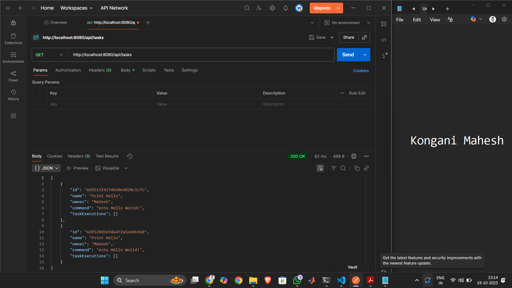
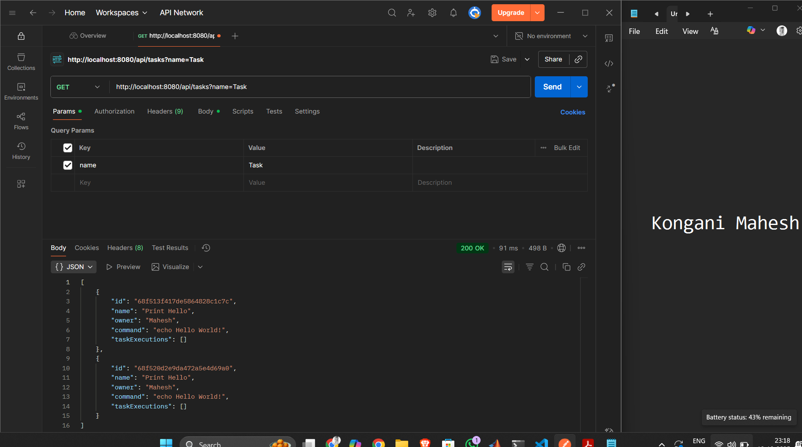

# Kaiburr Assessment - Task 1
## REST API for Task Management with MongoDB

This is a Spring Boot application that provides a REST API to manage "task" objects stored in a MongoDB database.

## Technology Stack

- **Java**: JDK 17
- **Spring Boot**: 3.2.0
- **Spring Web**: For REST API
- **Spring Data MongoDB**: For database interaction
- **Maven**: For project build
- **Lombok**: To reduce boilerplate code

## Prerequisites

1. **Java 17** or higher installed
2. **Maven** installed
3. **MongoDB Atlas** account (connection string already configured)

## Setup Instructions

### 1. Clone the Repository

```bash
git clone https://github.com/Mah03esh/kaiburr-task1.git
cd kaiburr-task1
```

### 2. Build the Project

```bash
mvn clean install
```

### 3. Run the Application

```bash
mvn spring-boot:run
```

The application will start on `http://localhost:8080`

## API Endpoints

### 1. Create a Task
- **Method**: `PUT`
- **URL**: `/api/tasks`
- **Body**: JSON Task object
- **Response**: 201 Created (or 400 Bad Request if command is unsafe)

```json
{
    "name": "Print Hello",
    "owner": "Mahesh",
    "command": "echo Hello World!"
}
```

### 2. Get All Tasks / Get Task by ID
- **Method**: `GET`
- **URL**: `/api/tasks` (all tasks) or `/api/tasks?id={taskId}` (specific task)
- **Response**: 200 OK with task(s) or 404 Not Found

### 3. Find Tasks by Name
- **Method**: `GET`
- **URL**: `/api/tasks/find?name={searchString}`
- **Response**: 200 OK with matching tasks or 404 Not Found

### 4. Delete a Task
- **Method**: `DELETE`
- **URL**: `/api/tasks/{id}`
- **Response**: 204 No Content

### 5. Execute a Task
- **Method**: `PUT`
- **URL**: `/api/tasks/execute/{id}`
- **Response**: 200 OK with updated task (including execution details) or 404 Not Found

## Security Features

The application includes command validation to prevent execution of potentially dangerous commands:

**Blocked Commands**: `rm`, `sudo`, `mv`, `cp`, `chmod`, `chown`, `reboot`, `shutdown`, `dd`, `mkfs`, `format`, `del /f`, `rmdir /s`

## MongoDB Configuration

The application connects to MongoDB Atlas using the connection string in `application.properties`

## Task Execution

When a task is executed via the `/api/tasks/execute/{id}` endpoint:

1. The system retrieves the task from the database
2. Executes the command locally using `ProcessBuilder`
3. Captures the output (stdout and stderr)
4. Records start time, end time, and output
5. Adds the execution details to the task's execution history
6. Saves and returns the updated task

## API Testing Documentation

### Test Scenarios (Gherkin Format)

#### Scenario 1: Create a New Task
**Feature:** Task Creation via REST API

```gherkin
Given the application is running on localhost:8080
When I send a PUT request to "/api/tasks"
  And the request body contains a valid task JSON:
    {
      "name": "Print Hello",
      "owner": "Mahesh",
      "command": "echo Hello World!"
    }
Then I should receive a 201 Created response
  And the response body should contain the created task with a generated ID
  And the task should be persisted in MongoDB
```

**Screenshot:**


---

#### Scenario 2: Retrieve All Tasks
**Feature:** List All Tasks

```gherkin
Given tasks exist in the database
When I send a GET request to "/api/tasks"
Then I should receive a 200 OK response
  And the response body should contain an array of all tasks
  And each task should have id, name, owner, command, and taskExecutions fields
```

**Screenshot:**


---

#### Scenario 3: Search Tasks by Name - Found
**Feature:** Search Tasks Containing Name String

```gherkin
Given a task with name "Print Hello" exists in the database
When I send a GET request to "/api/tasks/find?name=Hello"
Then I should receive a 200 OK response
  And the response body should contain an array of matching tasks
  And each task name should contain the search string "Hello"
```

**Screenshot:**


---

#### Scenario 4: Search Tasks by Name - Not Found
**Feature:** Search Tasks Returning 404 When Not Found

```gherkin
Given no tasks with name containing "XYZ_Not_A_Task" exist in the database
When I send a GET request to "/api/tasks/find?name=XYZ_Not_A_Task"
Then I should receive a 404 Not Found response
  And the response body should be empty
```

---

#### Scenario 5: Execute a Task
**Feature:** Task Execution with Command Execution

```gherkin
Given a task with id "673f0d13f417d5864d28c1c7c" exists in the database
  And the task has command "echo Hello World!"
When I send a PUT request to "/api/tasks/execute/673f0d13f417d5864d28c1c7c"
Then I should receive a 200 OK response
  And the task should be executed on the system
  And the response should include execution details:
    - startTime
    - endTime
    - output (command result)
  And the execution should be added to taskExecutions array
  And the task should be updated in the database
```

**Screenshot:**


---

#### Scenario 6: Delete a Task
**Feature:** Task Deletion

```gherkin
Given a task with specific id exists in the database
When I send a DELETE request to "/api/tasks/{id}"
Then I should receive a 204 No Content response
  And the task should be removed from the database
  And subsequent GET requests for that task should return 404
```

**Screenshot:**


---

#### Scenario 7: Get Task by ID - Found
**Feature:** Retrieve Specific Task by ID

```gherkin
Given a task with id "673f0d13f417d5864d28c1c7c" exists in the database
When I send a GET request to "/api/tasks?id=673f0d13f417d5864d28c1c7c"
Then I should receive a 200 OK response
  And the response body should contain the task details
  And the task should include all execution history in taskExecutions array
```

---

#### Scenario 8: Get Task by ID - Not Found
**Feature:** Return 404 for Non-Existent Task

```gherkin
Given no task with id "nonexistent123" exists in the database
When I send a GET request to "/api/tasks?id=nonexistent123"
Then I should receive a 404 Not Found response
  And the response body should be empty
```

---

#### Scenario 9: Command Validation - Unsafe Command
**Feature:** Prevent Execution of Dangerous Commands

```gherkin
Given the application has command validation enabled
When I send a PUT request to "/api/tasks"
  And the request body contains an unsafe command:
    {
      "name": "Dangerous Task",
      "owner": "Mahesh",
      "command": "rm -rf /"
    }
Then I should receive a 400 Bad Request response
  And the response should indicate command validation failure
  And the task should not be created in the database
```

## Example Workflow

1. **Create a task**: `PUT /api/tasks`
2. **View all tasks**: `GET /api/tasks`
3. **Execute the task**: `PUT /api/tasks/execute/{id}`
4. **View execution history**: `GET /api/tasks?id={id}`
5. **Search for tasks**: `GET /api/tasks/find?name=Hello`
6. **Delete the task**: `DELETE /api/tasks/{id}`

## Notes

- The application runs on Windows with `cmd.exe`, but also supports Linux/macOS with `sh`
- All task executions are stored in the database for historical tracking
- The API uses proper HTTP status codes (200, 201, 204, 400, 404)
- Input validation prevents execution of unsafe system commands

## Author

**Mahesh**  
Created for Kaiburr Assessment - Task 1

## License

This project is created for assessment purposes.
