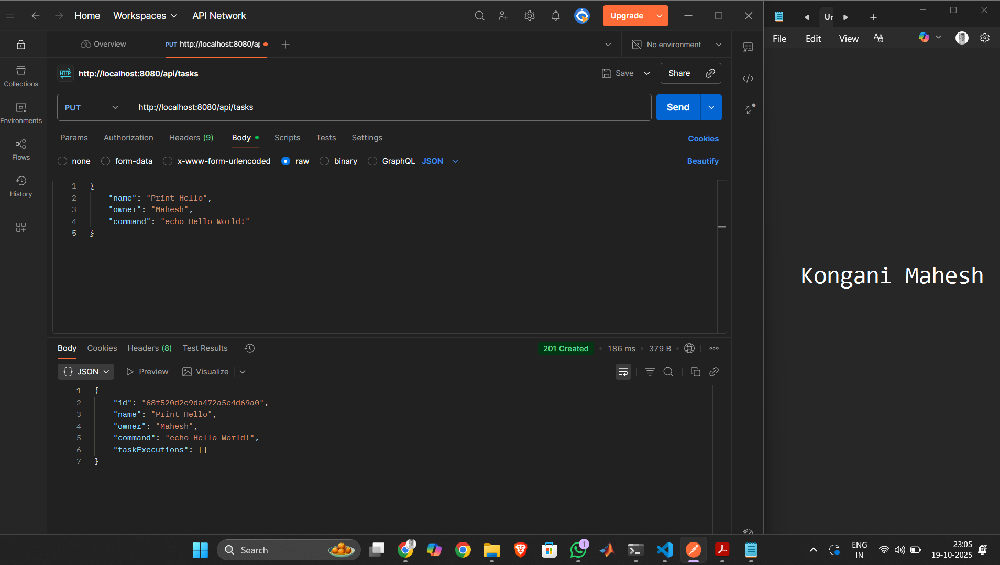

# Kaiburr Assessment - Task 1
## REST API for Task Management with MongoDB

A Spring Boot application providing REST API endpoints to manage task objects stored in MongoDB, with support for command execution and validation.

## Technology Stack

- Java 17
- Spring Boot 3.2.0
- Spring Data MongoDB
- Maven 3.9.11
- Lombok
- MongoDB Atlas

## Prerequisites

- Java 17 or higher
- Maven 3.9+
- MongoDB Atlas account

## Installation & Setup

**Clone the repository:**
```bash
git clone https://github.com/Mah03esh/kaiburr-task1.git
cd kaiburr-task1
```

**Build the project:**
```bash
mvn clean install
```

**Run the application:**
```bash
mvn spring-boot:run
```

The application starts on `http://localhost:8080`

## API Documentation

### Task Object Structure
```json
{
  "id": "string",
  "name": "string",
  "owner": "string",
  "command": "string",
  "taskExecutions": [
    {
      "startTime": "ISO 8601 datetime",
      "endTime": "ISO 8601 datetime",
      "output": "string"
    }
  ]
}
```

### Endpoints

#### 1. Create Task
```http
PUT /api/tasks
Content-Type: application/json

{
  "name": "Print Hello",
  "owner": "Mahesh",
  "command": "echo Hello World!"
}
```
**Response:** `201 Created` with task object, or `400 Bad Request` for unsafe commands

#### 2. Get All Tasks
```http
GET /api/tasks
```
**Response:** `200 OK` with array of all tasks

#### 3. Get Task by ID
```http
GET /api/tasks?id={taskId}
```
**Response:** `200 OK` with task object, or `404 Not Found`

#### 4. Find Tasks by Name
```http
GET /api/tasks/find?name={searchString}
```
**Response:** `200 OK` with matching tasks array, or `404 Not Found`

#### 5. Execute Task
```http
PUT /api/tasks/execute/{id}
```
**Response:** `200 OK` with updated task including execution details, or `404 Not Found`

#### 6. Delete Task
```http
DELETE /api/tasks/{id}
```
**Response:** `204 No Content`

## Security & Validation

The application validates all commands to prevent execution of potentially dangerous operations. The following commands are blocked:

`rm`, `sudo`, `mv`, `cp`, `chmod`, `chown`, `reboot`, `shutdown`, `dd`, `mkfs`, `format`, `del`, `rmdir`

Attempts to execute unsafe commands return `400 Bad Request` with an error message.

## Task Execution Process

When a task is executed via `/api/tasks/execute/{id}`:

1. Retrieves the task from MongoDB
2. Executes the command using `ProcessBuilder`
3. Captures stdout and stderr output
4. Records execution start time and end time
5. Stores execution details in the task's execution history
6. Returns the updated task object

## Testing & Validation

All API endpoints have been tested using Postman. Test scenarios follow the Given-When-Then syntax for clarity and standardization.

### Test Scenarios

**Scenario 1: Application Startup**  
Given Java 17 and Maven are installed  
When the application starts via `mvn spring-boot:run`  
Then the server listens on port 8080 and connects to MongoDB  


---

**Scenario 2: Create Task**  
Given a valid task JSON payload  
When a PUT request is sent to `/api/tasks`  
Then a 201 Created response is returned with the task object  



---

**Scenario 3: Get All Tasks**  
Given tasks exist in the database  
When a GET request is sent to `/api/tasks`  
Then a 200 OK response returns an array of all tasks  


---

**Scenario 4: Execute Task**  
Given a task exists with a safe command  
When a PUT request is sent to `/api/tasks/execute/{id}`  
Then a 200 OK response returns the task with execution details (startTime, endTime, output)  


---

**Scenario 5: Delete Task**  
Given a task exists in the database  
When a DELETE request is sent to `/api/tasks/{id}`  
Then a 204 No Content response confirms deletion  


---

**Scenario 6: Find by Name (Success)**  
Given tasks with matching names exist  
When a GET request is sent to `/api/tasks/find?name={searchString}`  
Then a 200 OK response returns matching tasks  


---

**Scenario 7: Get Task by ID (Success)**  
Given a task with the specified ID exists  
When a GET request is sent to `/api/tasks?id={id}`  
Then a 200 OK response returns the single task object  


---

**Scenario 8: Get Task by ID (Not Found)**  
Given no task exists with the specified ID  
When a GET request is sent to `/api/tasks?id={invalidId}`  
Then a 404 Not Found response is returned  


---

**Scenario 9: Find by Name (Not Found)**  
Given no tasks match the search criteria  
When a GET request is sent to `/api/tasks/find?name={invalidName}`  
Then a 404 Not Found response is returned  


---

**Scenario 10: Unsafe Command Validation**  
Given a task payload contains an unsafe command (e.g., `rm -rf /`)  
When a PUT request is sent to `/api/tasks`  
Then a 400 Bad Request response is returned with an error message  


## Architecture

The application follows a layered architecture pattern:

- **Controller Layer** (`TaskController`): Handles HTTP requests and responses
- **Service Layer** (`TaskService`): Contains business logic and validation
- **Repository Layer** (`TaskRepository`): Manages database operations
- **Model Layer** (`Task`, `TaskExecution`): Defines data structures

## Configuration

MongoDB connection details are configured in `src/main/resources/application.properties`:
```properties
spring.data.mongodb.uri=<MongoDB Atlas connection string>
```

## Example Workflow

1. Create a task with a safe command
2. Retrieve all tasks to verify creation
3. Execute the task to run the command
4. View execution history in the task object
5. Search for tasks by name
6. Delete the task when no longer needed

## Author

Mahesh  
Created for Kaiburr Assessment - Task 1

## License

This project is created for assessment purposes.
